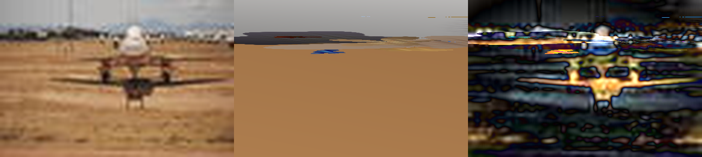
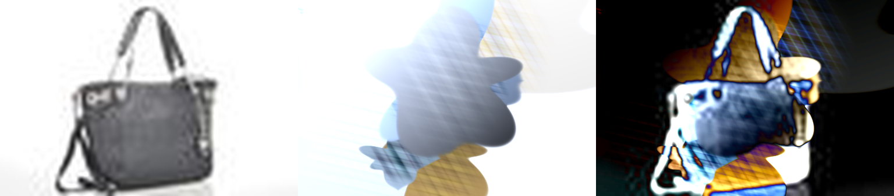
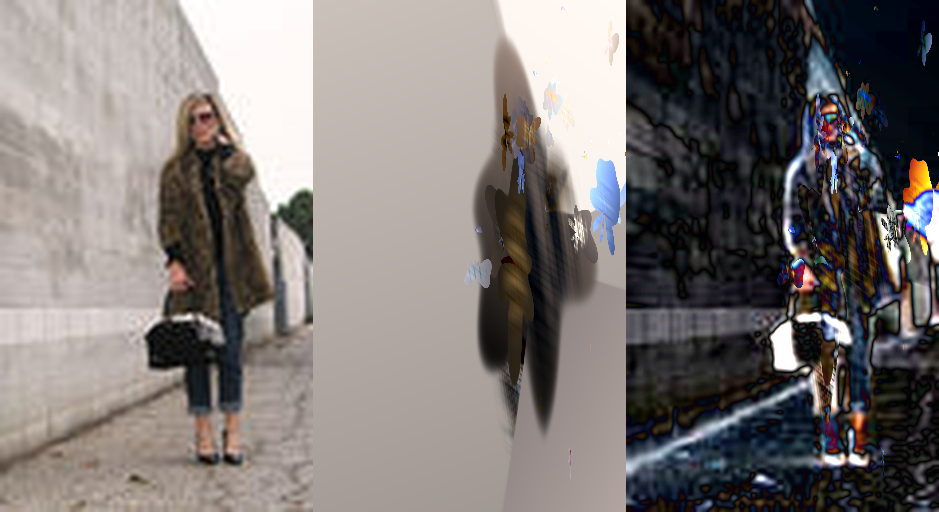
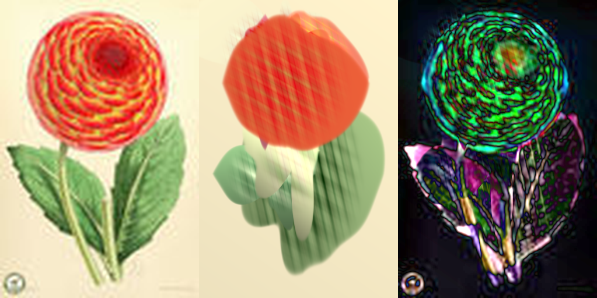
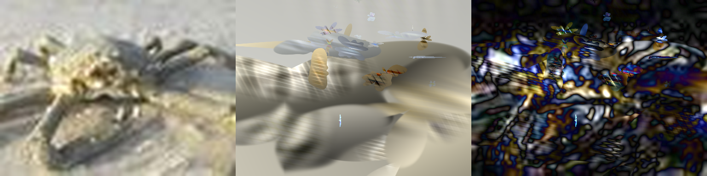

# comparisons

reconstructions matching yeganeh equations with full canvas normalized coords.

## metrics

| image | res | ssim | psnr | loss | layers |
|:---|:---:|:---:|:---:|:---:|:---:|
| testImage1029 | 512x384 | 0.9104 | 22.16 dB | 0.0961 | 64 |
| trainImage1008 | 512x512 | 0.8780 | 22.97 dB | 0.0990 | 64 |
| testImage1013 | 362x512 | 0.8437 | 22.09 dB | 0.1356 | 16 |
| testImage1023 | 512x384 | 0.8431 | 24.29 dB | 0.1325 | 64 |
| testImage10 | 512x339 | 0.8125 | 19.15 dB | 0.1522 | 16 |
| testImage1040 | 313x512 | 0.7991 | 21.45 dB | 0.1622 | 64 |
| testImage1014 | 341x512 | 0.7487 | 20.14 dB | 0.2055 | 16 |
| testImage1043 | 512x384 | 0.7181 | 20.59 dB | 0.2263 | 64 |

## samples

### testImage1029

### trainImage1008

### testImage1013

### testImage1023

### testImage10

### testImage1040

### testImage1014

### testImage1043

